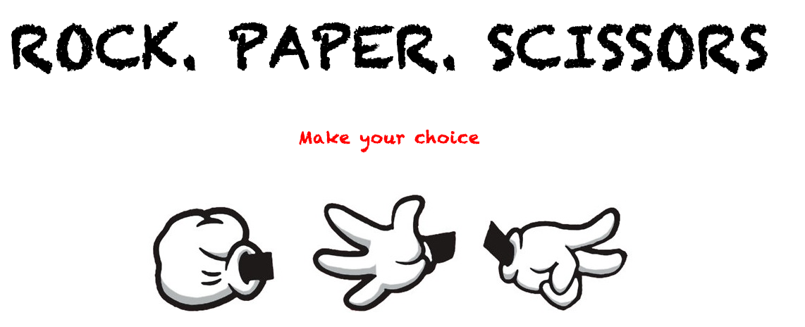

# Rock_Paper_Scissors_Javascript

+ TDD Rock Paper Scissors game with Jasmine and Javascript.
+ Used JQuery, SASS & HAML on the presentation layer.
+ Compiled with Grunt.



## Deployed
View [here] (https://javarps.herokuapp.com/)
## Technologies Used

* Javascript
* JQuery
* Jasmine
* Grunt
* SASS
* HAML

## How to set it up
```sh
git clone https://github.com/csharpd/rps-java.git
cd rps_java
```

## How to run it

```sh
cd rps_java
rackup
```

open your browser and go to [localhost:9292](http://localhost:9292)

## How to test it:

Open SpecRunner.html in the browser.


